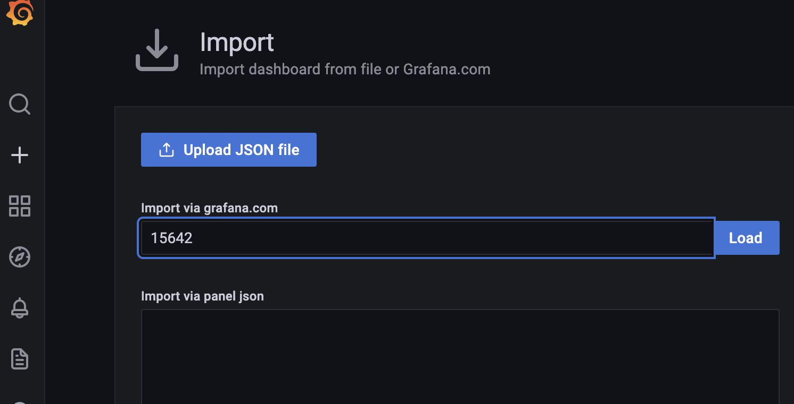

# Lab 1 - Set up the Lab Environment

In this lab you will:
- Verify your web terminal access
- Verify your Grafana Cloud access
- Deploy the sample application

## I. Verify web terminal access


A. Log into the web terminal. All files for the workshop have been put here and we will be using it as a place to run kubectl commands. This URL and the credentials will be given to you by your instructor. It will look something like:

```
https://wetty-<workshopName>.work-shop.grafana.net
```

B. For this workshop, we are all working in our own Kubernetes clusters. At the root of your home directory, you will find a file called `kubeconfig`. Set an OS environment variable `KUBECONFIG` to point to this file. IMPORTANT: If you log out and log back in, you will need to repeast this step.

```shell
export KUBECONFIG=$HOME/kubeconfig
```

C. Validate that you can see the context in your list:

```shell
kubectl config get-contexts
```

## II. Validate that you can log in to Grafana

<br>
A Grafana Cloud stack has been provisioned for you for this workshop. In this section we will validate that we can log into the instance.

<br>

A. Put your grafana stack URL into a browser. This will be:

```
https://<yourloginname>.grafana.net
```

If you logged into the web terminal with `karthik`, then your url will be `https://karthik.grafana.net`.

B. On the login screen, use the same username password that you did for the web terminal. Validate that you see the Grafana home screen.

<br>

**The first time you log in it might take a few seconds**

## III. Deploy the sample application

For the rest of the workshop, we will be using [Weaveworks Sockshop](https://microservices-demo.github.io/).

A. From your home directory in the web terminal, deploy the sockshop applications:

```shell
kubectl apply -f application/sockshop-demo-app.yaml
```

B. Open up k9s in the web terminal to see the progress of the application deploying. 

```shell
k9s
```


Validate that all of the pods are ready.

D. When everything is up, you should be able to reach the application via an https url that was created already. Your URL is: 

```
https://<my-login-name>.work-shop.grafana.net
```


That's it! You successfully deployed the sample application.

# STOP HERE

# Lab 2 - Blackbox monitoring

In this section, you will set up black box monitoring for the front-end of the application.

A. Go to your Grafana Dashboard. If you've lost the window, your URL is:

```
https://<my-login-name>.grafana.net
```

And your password is the same as the password for the web terminal.

B. In the left-hand menu, go to "Synthetic Monitoring>Home".  


C. You will need to scroll down and click on the `Initialize Plugin` button to get started. 


D. After initialization, in the menu bar across the top, choose `Checks`


E. The first check we will set up is a DNS check. Click on `New Check`


F. Fill in values:
    - Choose `DNS` as the check type
    - For `Job Name`, enter `dnsCheck`
    - For `Target` enter the domain name for your sockshop front end application. This looks like `<myname>.work-shop.grafana.net`.
    - Under `Probe Locations` choose `All` to populate the locations box.
    - Accept all other defaults and save

    When you save, you will be taken back to the home page for Synthetics Monitoring. Because the check has not had time to fire yet, you will see "N/A" for most of the values. 


G. Once values start filling in for Uptime and Reachability, click on `View Dashboard` at the bottom right of the entry.


H. When you open the dashboard, you will see the default dashboard for DNS checks. You should see something that looks similar to the following. If you do not, try refreshing your browser:


I. Following the process above, set up an HTTP check for the website, accepting defaults for anything you do not see. Note the `https://` at the front of the URL. (Your URL is `https://<my-login-name>.work-shop.grafana.net`):


J. Open the httpCheck dashboard until you see that it has run a few times.

K. Now we will scale down the front-end service that is serving the web pages. 

```shell
kubectl scale deployment --replicas=0 front-end
```

L. Verify that the front-end has no more instances running:

```shell
kubectl get deployments
```

M. Go back to the httpCheck dashboard and see that the check is now failing. Notice that you can see the associated log lines with the failed checks at the bottom.


N. Scale the front-end back up to one replica and make sure that you see successes starting to go through via the httpCheck dashboard.

```shell
kubectl scale deployment --replicas=1 front-end
```

O. Verify that the front-end is back up

```shell
kubectl get deployments
```

# STOP HERE

# Lab 3 - Configuring Grafana Agent for Metrics, Logs, and Traces

## I. Deploy the Metrics Agent

Now that we've done black box monitoring, we want to set up white box monitoring. To do this, we will install the Grafana Agent and configure it for metrics collection.

A. In your home folder in the web terminal, use `nano` or `vi` or `more` to open `metrics/metrics-agent-deploy.yaml`. If you are not familiar with either `nano` or `vi`, use `more`. This will create a Namespace, Deployment, Service Account, ClusterRole and ClusterRoleBinding. You do not need to edit this file, just review what it is doing.

```
more metrics/metrics-agent-deploy.yaml
```

B. Deploy the metrics agent:

```shell
kubectl apply -f metrics/metrics-agent-deploy.yaml
```

C. View that the agent is starting in k9s. If you do not see namespaces other than `default`, click on `0` to view all kubernetes namespaces.

```shell
k9s
```

D. Open `metrics/metrics-agent-cm.yaml` with `nano` or `vi` or `more`. Before the workshop, an API key was already created in your Grafana Cloud instance to be used for sending telemetry. This file has been filled in already with the appropriate credentials prior to the workshop for your Grafana Cloud instance, specifically:

    |Line no|Cloud Setting|ConfigMap Setting|
    |--|--|--|
    |18|Remote Write Endpoint|configs[agent]>remote_write>url|
    |20|Username/InstanceID|configs[agent]>remote_write>basic_auth>username|
    |21|Password/API Key|configs[agent]>remote_write>basic_auth>password| 
 
Do not edit the file. Just review it.

E. Deploy the agent ConfigMap.

```shell
kubectl apply -f metrics/metrics-agent-cm.yaml
```

F. Restart the agent so that it picks up the config map settings:
```shell
kubectl rollout restart deployments/grafana-metrics-agent -n grafana-metrics-ns
```

G. Now we need to verify that the data is arriving in Grafana Cloud. From your home Grafana Cloud page, click on the explore icon on the left hand side:


H. In the explore window, choose the prom data source for your cloud account. It will show up by default, with a name like grafanacloud-youracctname-prom


I. Click on metrics browser to make sure you see that the instance has been populated with your labels. The sockshop app has a label app=sockshop. That should appear in your metrics. If you see this label, this means that the metrics are arriving successfully. If you do not see this label, either ask the instructor, or use k9s to look at the logs for `grafana-metrics-agent`.


## II. Configuring Grafana Agent for Logs

Because promtail (one of the primary means of sending logs to Loki) scrapes logs via the local filesystem, we will be deploying the grafana agent as a daemonset to capture logs. The files for this lab can be found in `logs`.

A. In your home folder in the web terminal, use `nano` or `vi` to open `logs/logs-agent-deploy.yaml`. This will create a Namespace, Deployment, Service Account, ClusterRole and ClusterRoleBinding, similar to the `metrics/metrics-agent-deploy.yaml` file. You do not need to edit this file, just review what it is doing.

B. Deploy the Logs agent:

```shell
kubectl apply -f logs/logs-agent-deploy.yaml
```

C. The logs ConfigMap will tell the logs agent how to behave. The `logs/logs-agent-cm.yaml` for the logs agent has already been filled in with the details of your Grafana Cloud stack, specifically:

    |Line no|Cloud Setting|ConfigMap Setting|
    |--|--|--|
    |7|URL+`/loki/api/v1/push`|configs[clients]>url|
    |9|User|configs[clients]>basic_auth>username|
    |10|Password/API Key|configs[clients]>basic_auth>password| 

The API key is the same one from the metrics lab. They do not need individual keys.

D. Deploy the Logs agent configuration:
  
```shell
kubectl apply -f logs/logs-agent-cm.yaml
```

E. Restart the logs agent to pick up the values in the ConfigMap.

```shell
kubectl rollout restart daemonset/grafana-logs-agent -n grafana-logs-ns
```

F. Log into your Grafana dashboard instance and go to `Explore`. When you choose your logs data source, you should see several labels appear in the logs browser. If you only see `__name__`, try refreshing after a few minutes. If it is still just the `__name__` label, you will need to troubleshoot your deployment. Use k9s to view logs or speak to your instructor.

G. Make sure that you see a label `app=sockshop` and `Show Logs` to make sure you are seeing logs. If you see errors in the logs saying that no host could be found for grafana-traces-agent, that's ok. We will fix that next.


## III. Configuring Grafana Agent for Traces

This will start to feel like a familiar process. Now we will install the agent, but configured for traces.

A. Review `traces/traces-agent-deploy.yaml` and deploy it:

```shell
kubectl apply -f traces/traces-agent-deploy.yaml
```

B. Review `traces/traces-agent-cm.yaml`. We have already filled in the details for your Grafana Cloud stack in the files. Specifically:

|Line no|Cloud Setting|ConfigMap Setting|
|--|--|--|
|36|User|traces>configs[batch]>remote_write>basic_auth>username|
|37|API Key (the same one used for logs and metrics)|traces>configs[batch]>remote_write>basic_auth>password|

C. A block at the bottom will send traceIDs to logs. This is also already filled in with the details of your logging instance in Grafana Cloud. This allows the connections from traces to logs. The logs with traces will be associated with the label `job=all-the-traces`.


```yaml
    logs:
      configs:
        - name: cloud-traces
          clients:
            - url: https://<your logs endpoint>/api/v1/push
              basic_auth:
                username: <your logs user>
                password: <your api key>
              external_labels:
                job: all-the-traces
                namespace: grafana-traces-ns
```

D. Deploy the traces ConfigMap

```shell
kubectl apply -f traces/traces-agent-cm.yaml
```

E. Restart the traces agent to pick up the config map settings:

```shell
kubectl rollout restart deployment/grafana-traces-agent -n grafana-traces-ns
```


## IV. Generate load to create traces

A. In the `application` directory, you will find a file called `load-test.yaml`. Open it and review it. This will send requests through the `front-end` service.


B. Deploy the load test :

```shell
kubectl apply -f application/load-test.yaml
```

C. Wait for a few minutes, then open up your Grafana Cloud instance.

D. Go to Explore, and choose your logs data source. In the `Log browser` drop down, choose `all-the-traces` under `job`. Click on `Show logs`. This will show you logs lines where traceIDs were recorded. (This was the point of the logs configuration in the traces agent ConfigMap).


E. Click into one of the logs lines with the `>` in the left hand margin. 


F. You should see a button next to the `traceID` field. Click on this button to have the screen split and open up this trace in the right hand panel. Some of the more interesting traces are `GET /customers`.


G. If you click on `Logs for this span` and do not find logs, expand the range on the time picker in the menu bar.

## V. Import the Dashboard

Finally, we will import a simple dashboard to show some details of the `orders` pod.

A. In the left hand menu, choose Create>Import


B. You are going to import a dashbaord numbered `15642`.



C. At the bottom, choose the logs and metrics data sources for your stack.


D. Finally, load the dashboard. You should see the dashboard populate with data from your logs and metrics data sources. If no errors have occured yet with orders, that panel may be empty.


